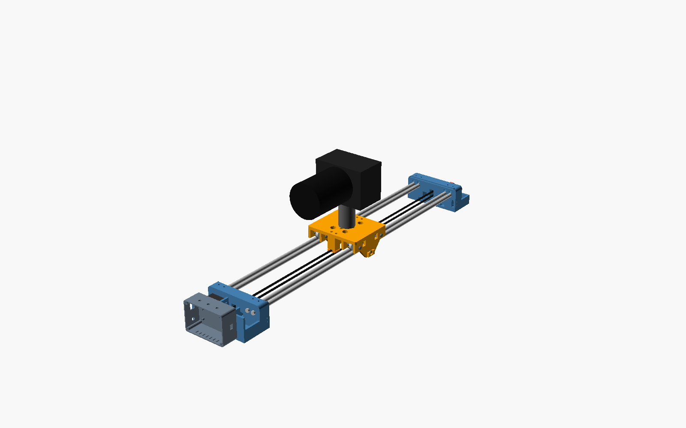
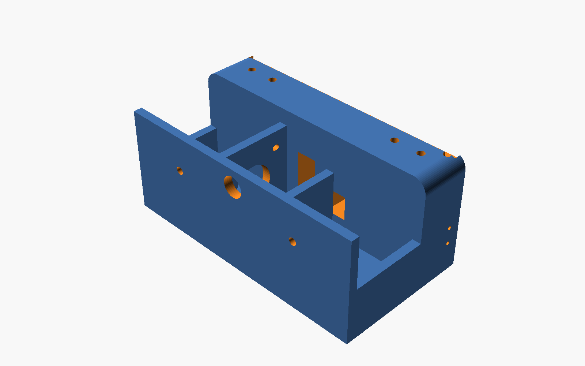
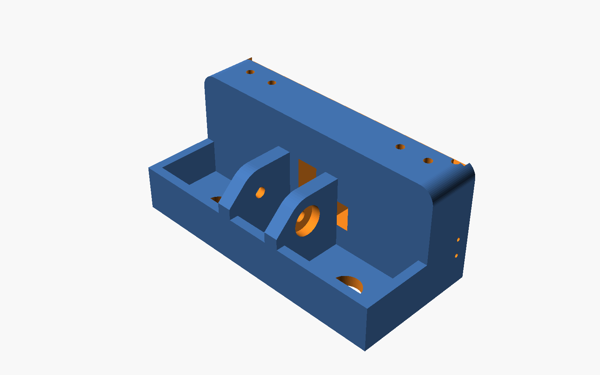
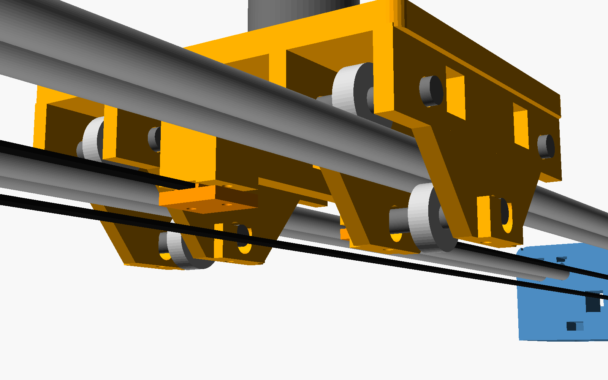

# Assembly

Tools: 2.5 / 3 mm Allen keys, small pliers, soldering iron, multimeter, hacksaw (if rods need cutting).

## 1. Prepare the end blocks

1. **Tripod nuts.** Push the nuts into the slots on the **inner face** (the face where the rods go in):
   two **1/4"-20** nuts (outer) and one **3/8"-16** nut (centre) in each block. A drop of CA glue holds
   them. Screw a tripod screw in from below to pull each one fully into its hex pocket.
2. **Rod set-screw nuts.** Slide an **M4 nut** into each of the 4 slots on the inner face, above each rod
   socket, then start an **M4×16** screw from the top (don't tighten yet).

## 2. Motor end

1. Put the **GT2 20T pulley** on the NEMA17 shaft, grub screw on the flat of the shaft. Don't tighten yet.
2. Lower the motor into the bay from above, on the side of the plate away from the belt slot.
   Its centring boss goes into the big plate hole and the shaft points toward the middle. Fix it with **4× M3×10** from the pulley side.
3. Slide the pulley so the teeth are in the middle of the belt slot. Tighten the grub screw.

## 3. Idler end (hand-crank)

1. Press a **625ZZ** bearing into the outside of each wall.
2. Slide the **5 mm shaft** in through one bearing, through the **GT2 pulley** (with M5 washers each
   side as spacers), then through the other bearing. Centre the pulley and tighten its grub screw.
3. Put the **hand wheel** on the long end of the shaft (side with ~20 mm sticking out). Tighten the
   M3 grub screw. Fit the **M5×30 bolt + spinner** into the wheel's outer hole as a crank handle.

*No crank wanted?* Use an M5×40 bolt + nyloc nut as the shaft and a toothless GT2 idler. The crank is
nice for slow manual moves with the belt still attached.

## 4. Carriage

The carriage rides on **6 × 608ZZ** rollers. Each track (pair of rods) gets **2 rollers on top**, sitting in
the groove between the two rods, and **1 roller underneath** pushing up into the same groove. The rollers
touch each rod on a line at about 30°, so the carriage can't move sideways or lift. Every contact rolls;
nothing slides.

1. Drop **M3 nuts** into the 4 hex pockets on top of the belt-clamp blocks.
2. Top rollers (×4): **M8×50** bolt → washer → cheek → **spacer** → 608ZZ → **spacer** → cheek → washer
   → **nyloc**. Tighten until the bearing can't wobble but still spins freely. The spacer's small lip
   must touch only the bearing's **inner** ring.
3. Bottom rollers (×2) go in later (step 5) with **M8×60** bolts, the same way, through the slots.
4. Screw an **M4×12** a few turns into each of the 4 holes under the bottom slots (they push the
   bottom rollers up).

## 5. Rails

1. Push the **4 × 10 mm rods** into one end block until they bottom out, and tighten the 4 M4 set-screws
   (roll each rod on a flat table first. A bent rod wobbles; don't use it).
2. Set the carriage on the rods: the top rollers sit in the two grooves.
3. Push the other end block onto the rods and tighten its set-screws.
4. Fit the 2 **bottom rollers** (M8×60) from the sides, through the slots, under each rod pair.
5. **Preload:** for each bottom roller, loosen its nut, turn the two M4 push screws until the roller just
   touches both rods, then **¼ turn more**. Tighten the M8 nut. Do it with the camera on. Correct preload =
   no play when you try to lift or twist the carriage, but it still glides with one finger and doesn't
   "notch". Too tight shortens bearing life and makes it rough.
6. Slide it end to end. If one spot is tight, a rod is bent or the rods aren't parallel. Loosen the
   set-screws, let the carriage centre the rods, retighten.

> Keep the rods clean and wipe them with a drop of light oil (sewing-machine oil) on a cloth. Dust on the
> rods is the main cause of noise with rollers.

## 6. Belt

1. Clamp one belt end under the **motor-side** clamp block: belt **teeth down**, the **clamp plate** (teeth up)
   under it, **2× M3×16** from below.
2. Run the belt through the motor end, around the motor pulley, along the bottom, around the idler pulley
   and back to the carriage.
3. Pull it tight (it should "twang" like a low guitar string, not be rock hard). Clamp it with the second
   plate. Use the **thumb knob** on one of the two screws on this side: that's your quick release.
4. Fine tension: loosen the 4 motor screws, slide the motor in its 1 mm slots, retighten.

## 7. Endstops

Each end block has a pocket on its inner face, on the **+X side below the rods**. Push a **KW11** switch in
(lever facing the carriage) and fix it with **2× M2** screws from the outside of the block. The carriage's
outer roller cheek presses the lever before it reaches the block. Bend the lever slightly if it doesn't
click about 2 mm before the cheek touches the block. Wires go up through the small hole into the top
channel.

## 8. Electronics

Wire everything per [WIRING.md](WIRING.md), mount the perfboard in `elec_box`, and fix the box to the
motor end's rear wall with **2× M4×12 + nuts**. The cables go through the 12 mm hole.

**Before first power-up:** set the LM2596 output to **5.0 V** with the ESP32 *disconnected*. Set the
TMC2209 Vref (see wiring doc).

## 9. Flash the firmware

See [../firmware/README.md](../firmware/README.md).

## 10. First test

1. Power on with the camera **off** the slider.
2. Connect to Wi-Fi **CamSlider-XXXX** (password `slider123`) and open **http://192.168.4.1**.
3. Press **Home**. The carriage should move toward the **motor end**. If it goes the other way, press STOP,
   then open *Settings* and set *Invert dir* = 1 → Save.
4. Jog to the far end, check the reading, and set *Travel* to that value (minus a few mm).
5. Mount the ball head, then the camera.

## Mounting options

| Use | How |
|-----|-----|
| **2 tripods** | one tripod under each end block (1/4" or 3/8" thread). Level both. Best for long/heavy moves |
| **1 tripod** | under the **motor end** (heavier end) for short rails only, with the camera kept near that end. A second tripod or a light stand under the idler end is much better |
| **Table / floor** | sits on the flat bottoms of the end blocks. Add the **table feet** (screwed into a 1/4" nut) with rubber pads for a wider stance, or stick rubber pads on directly |
| **Angled** | different tripod heights. Keep the slope under ~30° and raise motor current a bit |

## Hand-driven modes

| Mode | How | Use |
|------|-----|-----|
| **Motor off** | app button / long-press the knob → `MOTOR OFF`. Driver releases the motor | push the carriage by hand, belt stays on. Push slowly: moving the motor fast makes it act as a generator |
| **Crank** | motor off + turn the hand wheel on the idler end | smooth, slow manual moves |
| **Fully free** | loosen the **thumb knob** and slip the belt out of the clamp | like a plain manual slider. Re-clamp and **HOME** after |
| **Electronic hand wheel** | turn the rotary knob on the box: 5 mm per click, press to switch to 0.5 mm | precise framing, motor holds position |
